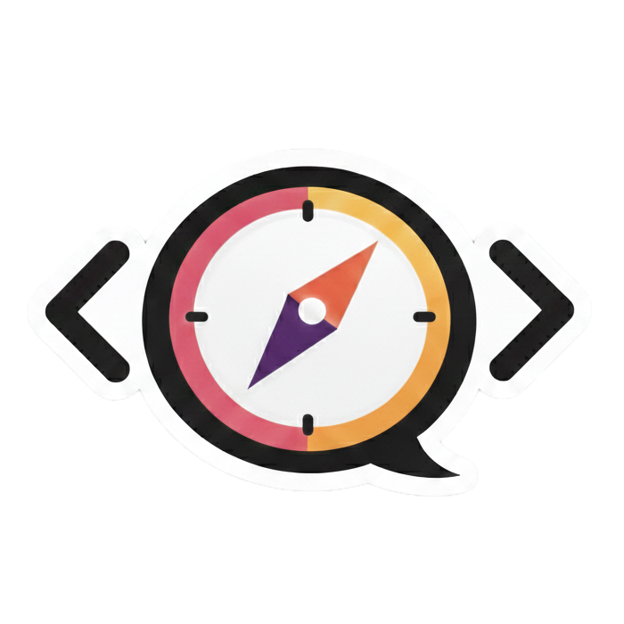

<p align="center">
  
</p>

<h1 align="center">CodeCompass</h1>

<p align="center">
  <i>Navigate your codebase to excellence — AI-driven quality analysis powered by ISO 25010.</i>
</p>

---

Evaluate any repository across six quality dimensions — **Security**, **Reliability**, **Maintainability**, **Performance**, **Flexibility**, and **Usability** — using LLM-driven judgments mapped to CWE classifications. Get actionable insights, not just metrics.

## Prerequisites

- Python 3.12+
- [uv](https://docs.astral.sh/uv/) package manager
- Node.js 18+ (auto-installed for dashboard)
- An AI CLI client (e.g. Claude Code)

## Quick Start

### Install

```bash
uv sync
```

### Run the Dashboard

```bash
uv run codecompass dashboard
```

This will:
1. Install npm dependencies and build the web UI (first run only)
2. Start the Python Action API on an available port (default 8001)
3. Start the dashboard server on `http://localhost:4173`
4. Open your browser automatically

### Run an Evaluation (CLI)

```bash
# Evaluate a local repository (auto-detects language plugin)
uv run codecompass evaluate /path/to/your/project

# Evaluate a remote repository
uv run codecompass evaluate git@github.com:org/repo.git

# Evaluate specific dimensions only
uv run codecompass evaluate /path/to/project -d security,reliability

# Use a specific plugin
uv run codecompass evaluate /path/to/project -p typescript

# Evidence only (skip scoring)
uv run codecompass evaluate /path/to/project --evidence-only
```

### Configure AI Client

```bash
uv run codecompass configure
```

## Dashboard Options

```bash
uv run codecompass dashboard --port 8080           # custom port
uv run codecompass dashboard --open false           # skip auto-opening browser
uv run codecompass dashboard --no-build             # skip web UI build (requires ui/web/dist)
uv run codecompass dashboard --evaluations <dir>    # custom evaluations directory
uv run codecompass dashboard --api-host 127.0.0.1   # override Action API host
uv run codecompass dashboard --api-port 8001        # override Action API port
uv run codecompass dashboard --reinstall            # force reinstall npm dependencies
```

## Development

### Dashboard (dev mode)

Start the Action API:

```bash
uv run python -m codecompass.action_api
```

Then in another terminal:

```bash
cd ui/web
npm install
npm run dev
```

Open `http://localhost:5173`.

### Run Tests

```bash
uv run pytest
```

## Project Structure

```
codecompass/
  src/codecompass/          # Python package
    engine/                 # V2 evaluation engine (analysis, scoring, reporting)
    dashboard/              # Dashboard server
    adapters/               # Report parsers and filesystem adapters
    config/                 # CLI configuration and knowledge refresh
    util/                   # Repo handling utilities
  evaluators/               # Language plugins (typescript, python, kotlin, java, bash, ios)
  standards/                # ISO 25010, ASVS, CISQ standards with compiled CWE mappings
  prompts/                  # LLM prompt templates
  ui/web/                   # React + Vite dashboard
  evaluations/              # Evaluation output (generated)
  tools/                    # Standards compiler, migration scripts
```

## API Endpoints

| Method | Endpoint | Description |
|--------|----------|-------------|
| `GET` | `/api/projects` | List all evaluated projects |
| `GET` | `/api/projects/:project/dashboard` | Project dashboard data |
| `GET` | `/api/projects/:project/accumulated` | Accumulated scores over time |
| `GET` | `/api/projects/:project/runs/:run/dimensions/:dim/eval` | Dimension evaluation detail |
| `GET` | `/api/projects/:project/runs/:run/violations` | Run violations |
| `POST` | `/api/evaluations` | Start a new evaluation |
| `GET` | `/api/evaluations/:jobId` | Evaluation job status |
| `GET` | `/api/plugins` | List available plugins and dimensions |
| `GET` | `/api/browse` | Browse local filesystem |
