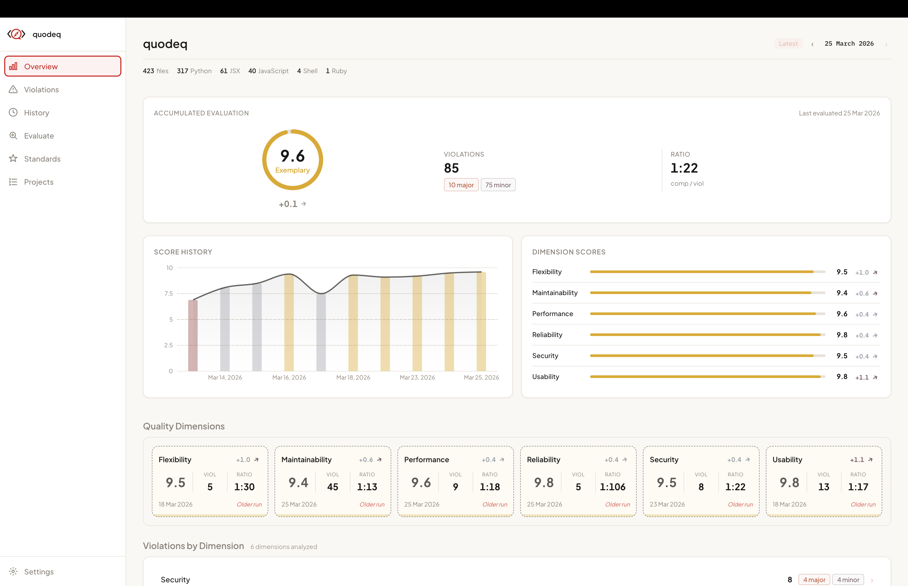

<p align="center">
  <picture>
    <source media="(prefers-color-scheme: dark)" srcset="res/quodeq-logo-dark.svg" />
    
  </picture>
</p>

<h2 align="center">The quality code compass</h2>
<p align="center"><em>Your guide to drive any codebase to excellence.</em></p>
<p align="center"><strong>v0.8.1</strong></p>

<p align="center">
  Quodeq scans any codebase with AI and scores it across six quality dimensions —
  <strong>Security</strong>, <strong>Reliability</strong>, <strong>Maintainability</strong>,
  <strong>Performance</strong>, <strong>Flexibility</strong>, and <strong>Usability</strong> —
  based on ISO 25010. Get grades, find violations, fix what matters.
</p>

<p align="center">
  <a href="https://www.youtube.com/watch?v=YUq9cr__2CI">Watch the demo</a> · <a href="https://quodeq.ai">Website</a> · <a href="https://github.com/quodeq/quodeq/releases/latest">Releases</a>
</p>

---

## Getting Started

```bash
pipx install quodeq    # Install quodeq
quodeq dashboard       # Launch the dashboard
```

That's it. The dashboard lets you point to any project and run evaluations from the UI.

> Also available via `brew install quodeq/tap/quodeq` or `pip install quodeq`.

### Requirements

| Dependency | Version | |
|---|---|---|
| [Python](https://www.python.org/downloads/) | 3.12+ | Runtime (`brew install python` or [download](https://www.python.org/downloads/)) |
| [Node.js](https://nodejs.org/) | 18+ | Dashboard UI (`brew install node` or [download](https://nodejs.org/)) |
| [Claude Code](https://docs.anthropic.com/en/docs/claude-code) | latest | AI analysis engine (`npm i -g @anthropic-ai/claude-code`) |

> During the current development phase, Quodeq uses Claude Code as its AI analysis engine. We plan to expand LLM ecosystem support in future releases, including other providers and local LLMs.

> **Optional:** Setting `ANTHROPIC_API_KEY` enables the dashboard to fetch the latest available models from the Anthropic API. Without it, a built-in default model list is used. Claude Code CLI handles its own authentication — no API key is needed to run evaluations.

---

## Dashboard

The Quodeq Dashboard is the main way to use Quodeq. Launch evaluations, browse results, and track quality over time — all from a single web UI.

```bash
quodeq dashboard
```

<p align="center">
  
</p>

Opens at `http://localhost:4173` with:

- **Overall grade & score** — A-F letter grade, numeric score /10, trend across runs
- **Dimension breakdown** — individual scores per quality dimension with severity counts
- **Violations explorer** — drill into findings by file, principle, or CWE classification
- **Top offending files** — ranked list of where to focus remediation
- **Run history** — track how your codebase evolves over time

Click any dimension, file, or principle to explore the details.

### QuodeqBar (macOS) — coming soon

A native menu bar companion app to manage the dashboard — start/stop the server, see evaluation status at a glance, and open the dashboard in one click.

> **Early preview:** You can try it now by downloading the DMG from [Releases](https://github.com/quodeq/quodeq/releases/latest). Since it's not yet signed, allow it with:
> ```bash
> xattr -cr /Applications/QuodeqBar.app
> ```

### CLI usage

You can also run evaluations directly from the terminal:

```bash
quodeq evaluate /path/to/project
```

Run `quodeq evaluate --help` and `quodeq dashboard --help` for all available options.

---

## How It Works

1. **Detect** — identifies the languages and structure of the codebase
2. **Analyze** — spawns an AI CLI with read-only tools to explore the code
3. **Collect** — findings stream as structured JSONL via tool calls
4. **Score** — maps findings to ISO 25010 principles with CWE classifications
5. **Report** — produces per-dimension reports with grades, violations, and compliance

Results are stored in `~/.quodeq/evaluations/` and persist across sessions.

## Supported Languages

Quodeq can evaluate **any codebase in any language**. The AI analysis engine reads and understands code regardless of the tech stack.

---

## The Q² Scoring Formula

Quodeq scores each principle on a 0–10 scale using four independent constraints:

1. **Violation Base** — hyperbolic curve where the first violations hurt most (`10 / (1 + K * weighted_violations)`)
2. **Compliance Lift** — evidence of good practices fills the gap between the base and 10
3. **Violation Ceiling** — log₂-based cap prevents compliance from overriding significant violations
4. **Severity Grade Floor** — grade labels match reality (only critical violations can produce a "Critical" grade)

The final score: `max(floor, min(ceiling, base + (10 - base) * lift))`

Full details in [src/quodeq/core/scoring/README.md](src/quodeq/core/scoring/README.md).

## Development

```bash
git clone https://github.com/quodeq/quodeq.git && cd quodeq
uv sync
uv run pytest
```

### Built with Claude Code

Development powered by [Claude Code](https://claude.ai/code) from [Anthropic](https://anthropic.com).

## Changelog

See [CHANGELOG.md](CHANGELOG.md) for release history.

## License

See [LICENSE](LICENSE).
