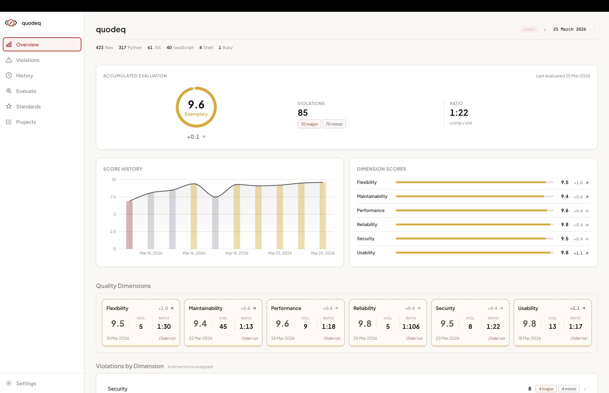

<p align="center">
  <picture>
    <source media="(prefers-color-scheme: dark)" srcset="res/quodeq-logo-dark.svg" />
    
  </picture>
</p>

<h2 align="center">AI-powered code quality and security scanner</h2>
<p align="center">
  <a href="https://github.com/quodeq/quodeq/actions/workflows/test.yml"></a>
  <a href="https://github.com/quodeq/quodeq/blob/main/LICENSE"></a>
  <a href="https://pypi.org/project/quodeq/"></a>
</p>

<p align="center">
  <a href="https://www.youtube.com/watch?v=Ie7rAiPBDQE&list=PLJjpl8sE7W-U1HMePWdGis7w834NPYD3R&index=1">Watch the demo</a> · <a href="https://quodeq.ai">Website</a> · <a href="https://quodeq.ai/blog/">Blog</a> · <a href="https://github.com/quodeq/quodeq/discussions">Discussions</a> · <a href="https://github.com/quodeq/quodeq/releases/latest">Releases</a>
</p>

---

AI models can now find vulnerabilities and design flaws that human review misses, but most tools that put this to work are locked behind enterprise contracts. Quodeq is the open alternative.

**Open source. MIT license. Runs locally. No telemetry. No account. No servers.**

Scans any codebase with AI across six quality dimensions from [ISO 25010](https://www.iso.org/standard/35733.html):
**Security**, **Reliability**, **Maintainability**, **Performance**, **Flexibility**, and **Usability**.

Every finding maps to a [CWE](https://cwe.mitre.org/) identifier. You get grades, violations with line numbers, and a fix plan. Cloud providers (Claude, Gemini, Codex) for speed. Local models via [Ollama](https://ollama.com) for privacy.

---

## What It Finds

```
CRITICAL    src/db.py:15        SQL injection via string concatenation     CWE-89
            query = f"SELECT * FROM users WHERE id = {user_id}"

MAJOR       src/auth.py:42      Hardcoded credentials in source code       CWE-798
            credentials = {"user": "admin", "pass": "secret123"}

MINOR       src/utils.py:23     Bare except clause hides errors            CWE-396
            except: pass

COMPLIANT   src/api.py:88       Parameterized query prevents injection     CWE-89
            cursor.execute("SELECT * FROM users WHERE id = ?", (user_id,))
```

Each finding includes a reason, the offending code, and a fix plan. Results are stored as JSON on your machine.

---

## Getting Started

### 1. Prerequisites

> **On macOS you can skip this step** by installing through Homebrew (see step 2). The
> formula pulls in its own Python.

| OS | Command |
|---|---|
| **macOS** | `brew install python pipx` |
| **Windows** | `winget install Python.Python.3.13` then `python -m pip install --user pipx && python -m pipx ensurepath` |
| **Debian / Ubuntu** | `sudo apt install -y python3.12 python3-pip pipx` |
| **Fedora / RHEL** | `sudo dnf install -y python3.12 python3-pip pipx` |
| **Arch** | `sudo pacman -S python python-pipx` |

> **Debian/Ubuntu heads-up:** If you use the native desktop window (not `--browser`), you'll need `sudo apt install -y python3-gi gir1.2-webkit2-4.1` too. Otherwise quodeq will auto-fall-back to opening the dashboard in your default browser.

> **Windows note:** The test suite runs on `windows-latest` as a **blocking** CI gate, so a Windows regression blocks the PR. The desktop window (WebView2) is smoke-tested manually per release. If anything misbehaves, please [open an issue](https://github.com/quodeq/quodeq/issues).

Minimum versions: Python 3.12+. (The dashboard UI ships pre-built inside the wheel, so end users no longer need Node.js or npm. Contributors who want to iterate on the UI source need Node 20+ and npm 10+, see [CONTRIBUTING.md](CONTRIBUTING.md).)

### 2. Install quodeq

**Homebrew** (macOS, and the shortest path):

```bash
brew install quodeq/tap/quodeq
```

**pipx / pip** (every platform):

```bash
pipx install quodeq    # isolated, recommended
# or: pip install quodeq
```

Prefer a desktop app to the CLI? See [Desktop apps](#desktop-apps-beta) below.

### 3. Pick an AI provider

Quodeq needs an LLM to do the evaluation. You have two options:

**Local, free, private** — [Ollama](https://ollama.com/download) with Gemma 4:
```bash
# install ollama from https://ollama.com/download, then:
ollama pull gemma4:26b
ollama serve    # runs in the background
```

**Cloud, faster** — one of the agentic CLIs (at least one):
- [Claude Code](https://docs.anthropic.com/en/docs/claude-code/overview) — `npm install -g @anthropic-ai/claude-code`
- [Codex CLI](https://developers.openai.com/codex/quickstart) — `npm install -g @openai/codex`
- [Gemini CLI](https://geminicli.com/docs/get-started/installation/) — `npm install -g @google/gemini-cli`

[llama.cpp](#ai-providers) is also supported. See [AI Providers](#ai-providers) for the
full list and how to choose.

### 4. Launch the dashboard

```bash
quodeq
```

The dashboard opens at `http://127.0.0.1:7863`. Use **Settings → AI Provider** to select the one you installed in step 3, then **Evaluate** to point at a project and start your first scan.

If the native window doesn't show up (common on Linux without GTK), run `quodeq --browser` instead.

### Desktop apps (beta)

Every release attaches two prebuilt apps to [Releases](https://github.com/quodeq/quodeq/releases/latest). They bundle their own Python, so none of the prerequisites above apply.

| Download | Platform | What it is |
|---|---|---|
| `Quodeq-<version>-macOS.dmg` | macOS | The dashboard in a native window, with an optional menu bar icon (Settings, "Show menu bar icon") that starts, stops, and monitors it |
| `Quodeq-<version>-Windows.zip` | Windows | The dashboard in a native window (WebView2) |

**macOS.** Open the `.dmg` and drag the app to Applications. The apps are unsigned, so
the first launch needs one of:

```bash
xattr -cr /Applications/Quodeq.app
```

Or right-click the app, select Open, then click Open in the dialog.

**Windows.** Unzip anywhere and run `Quodeq.exe`. SmartScreen will warn about an
unrecognized publisher on first launch: choose **More info** then **Run anyway**.

---

## Dashboard

<p align="center">
  <picture>
    <source media="(prefers-color-scheme: dark)" srcset="res/dashboard-dark.png" />
    
  </picture>
</p>
<br>

- **Grades and scores** per dimension with A-F letter grades, numeric scores, and trends across runs
- **Violations explorer** to drill into findings by file, principle, or CWE classification
- **Code map** showing a visual heatmap of where issues concentrate in your codebase
- **Custom standards** to create your own evaluation dimensions or import from the library

Click any dimension, file, or principle to explore the details. Dismiss false positives directly from the UI.

Running `quodeq` is equivalent to `quodeq dashboard`. Both open the same UI.

### CLI

```bash
quodeq evaluate /path/to/project
quodeq evaluate /path/to/project --scope src/api    # Scoped to a subdirectory
quodeq evaluate /path/to/project -d security        # Single dimension
```

### Excluding paths (`.quodeqignore`)

To keep fixture, vendored, or generated code out of an evaluation, add a
`.quodeqignore` file at the scan root. Each line is a glob pattern matched
against paths relative to that root; a pattern that names a directory excludes
everything under it. Blank lines and `#` comments are skipped, and `*` crosses
directory separators.

```gitignore
# test fixtures with intentionally bad code
benchmarks/corpus/
tests/fixtures

# generated files, at any depth
*.gen.py
*.min.js
```

Exclusions apply everywhere files are collected — full scans, `--scope` runs,
monorepo subproject discovery, and `--diff-from` change detection — on top of
the built-in skips (`node_modules`, `dist`, dot-directories, ...).

### SARIF / GitHub code scanning

Quodeq can emit findings as [SARIF 2.1.0](https://docs.oasis-open.org/sarif/sarif/v2.1.0/sarif-v2.1.0.html)
for GitHub code scanning (the Security tab), GitLab SAST, or any SARIF
consumer. Generate it during a scan, or export it from a past run:

```bash
quodeq evaluate . --sarif quodeq.sarif            # during a scan
quodeq export sarif --evaluation-dir <dir> -o quodeq.sarif   # from existing reports
```

Code snippets are omitted by default (so source never leaves your machine on
upload); pass `--with-snippets` to include them. Use `--min-severity` to drop
low-severity findings.

Upload to GitHub code scanning:

```yaml
- run: quodeq evaluate . --sarif quodeq.sarif
- uses: github/codeql-action/upload-sarif@v3
  with:
    sarif_file: quodeq.sarif
```

---

## AI Providers

Choose what fits your workflow. Configure in **Settings** from the dashboard.

| Provider | Type | Getting started |
|---|---|---|
| [Ollama](https://ollama.com/download) | Local | Free, private, code never leaves your machine |
| [llama.cpp](https://github.com/ggml-org/llama.cpp) | Local | Run any GGUF directly. Supports speculative decoding (MTP) via a draft model |
| [Claude Code](https://code.claude.com/docs/en/quickstart) | Cloud | Best balance of speed, quality, and cost |
| [Codex CLI](https://developers.openai.com/codex/quickstart) | Cloud | OpenAI models |
| [Gemini CLI](https://geminicli.com/docs/get-started/installation/) | Cloud | Google models |

> For local analysis we recommend [Gemma 4](https://deepmind.google/models/gemma/gemma-4/) ([`gemma4:26b`](https://ollama.com/library/gemma4:26b)). Reducing the context window to 32k still gives good results and allows running multiple subagents in parallel.

### Using llama.cpp

llama.cpp is one process per model, fixed at launch. Start `llama-server` yourself, then point Quodeq at it from **Settings → AI Provider → llama.cpp**.

```bash
# Quodeq creates ~/.quodeq/logs/ on first launch — just redirect there
# and the CONSOLE button picks it up automatically.
llama-server -m path/to/target.gguf --port 8080 \
  > ~/.quodeq/logs/llama-server.log 2>&1

# Speculative decoding (MTP), pair a target with a smaller drafter
llama-server -m path/to/target.gguf -md path/to/drafter.gguf --port 8080 \
  > ~/.quodeq/logs/llama-server.log 2>&1
```

Quodeq probes `http://localhost:8080` and looks for the log file at `~/.quodeq/logs/llama-server.log` (or platform-standard locations like `~/Library/Logs/llama-server.log` on macOS). Override with `LLAMACPP_LOG_FILE`. To use a different port or host, set `LLAMACPP_BASE_URL`. To switch models, stop `llama-server` and relaunch with a different `-m`.

---

## How It Works

1. **Detect** languages, frameworks, and project structure
2. **Analyze** with AI agents that read the code using read-only tools
3. **Collect** findings as structured JSONL via tool calls
4. **Score** against [ISO 25010](https://www.iso.org/standard/35733.html) principles with [CWE](https://cwe.mitre.org/) classifications
5. **Report** per-dimension grades, violations, compliance, and fix plans

Results are stored in `~/.quodeq/evaluations/` and persist across sessions. Works with any language. The AI analysis engine reads and understands code regardless of the tech stack.

Quodeq scores each principle on a 0 to 10 scale using four independent constraints. Full details in [the scoring formula documentation](src/quodeq/core/scoring/README.md).

### Standards

By default, Quodeq evaluates the six ISO 25010 dimensions. It also ships with **Clean Architecture** and **Domain-Driven Design** standards. You can create your own from the dashboard, or ask any AI to generate one as a `.json` file and import it.

Numeric thresholds on the built-in standards (max function lines, max parameters, ...) can be tuned per project from the dashboard. Overrides live in `.quodeq/standards-overrides.json` at the repo root, so the whole team scans with the same numbers.

### Threat model

By default Quodeq scores a project as if it were a hosted multi-tenant service. For a
local-first tool that produces noise: a file path built from a value the operator already
controls gets reported as an attack surface, and the real findings get buried under it.

A project can say what it actually is, in `.quodeq/project-profile.json` at the repo root:

```json
{
  "version": 1,
  "multiTenant": false,
  "networkExposure": "loopback"
}
```

`multiTenant` answers whether more than one user's data lives behind the same code.
`networkExposure` is one of `loopback`, `lan`, or `public`, and answers whether an
untrusted party can open a socket to the process.

Findings the declared model rules out are capped at `minor` rather than dropped, and
carry a marker naming the rule that moved them, so nothing becomes invisible. A finding
whose evidence names a real remote source is never capped, whatever the profile says.

The file is optional. Without it Quodeq infers what it can from your manifests and
otherwise assumes the most pessimistic model, which is how it behaves today.

---

## Privacy

There is no Quodeq account, no Quodeq server, and no telemetry. Your source code is read
locally and evaluation results are written to `~/.quodeq/evaluations/` as plain JSON. If
you run a local provider, nothing about your code leaves the machine at all. If you pick a
cloud provider, your code goes to that provider under your own API key and nowhere else.

Quodeq makes exactly one network call of its own: a daily unauthenticated version check
(PyPI for `pip`/`pipx`/`uv` installs, GitHub Releases for the desktop apps). It shows a
dismissible notice with the right upgrade step and never replaces itself. Turn it off with
`QUODEQ_NO_UPDATE_NOTIFIER=1`, or under **Settings → Updates**.

---

## Development

Run from a fresh checkout:

```bash
git clone https://github.com/quodeq/quodeq.git && cd quodeq
uv sync                   # install Python deps into .venv/
uv run quodeq             # launch the dashboard
uv run pytest             # run the test suite
```

Same OS prerequisites as the pipx install (Python 3.12+), plus Node 20+ and npm 10+ because a source checkout builds the dashboard UI from the working copy. You also need a configured LLM provider (Ollama or Claude Code / Codex CLI / Gemini CLI) before you can actually scan anything.

If the dashboard window doesn't appear on Linux, run `uv run quodeq --browser` (the native window needs `python3-gi` + `gir1.2-webkit2-4.1`, which aren't pulled in by the pip wheel).

---

## Contributing

Issues and pull requests are welcome. [CONTRIBUTING.md](CONTRIBUTING.md) covers the
development setup, the test suite, and how changes get reviewed. Everyone taking part is
expected to follow the [Code of Conduct](CODE_OF_CONDUCT.md).

- **Found a bug or want a feature?** [Open an issue](https://github.com/quodeq/quodeq/issues).
- **Want to ask something, or show what you built?** [Discussions](https://github.com/quodeq/quodeq/discussions).
- **Found a security problem?** Please don't open a public issue. [SECURITY.md](SECURITY.md) has the disclosure process.

If Quodeq is useful to you, starring the repo genuinely helps other people find it.

## Changelog

See [CHANGELOG.md](CHANGELOG.md) for release history, or the
[release announcements](https://github.com/quodeq/quodeq/discussions/categories/announcements)
for the readable version.

## License

MIT. See [LICENSE](LICENSE).
