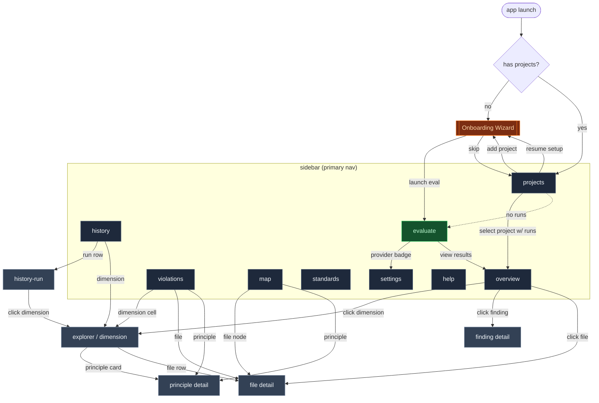
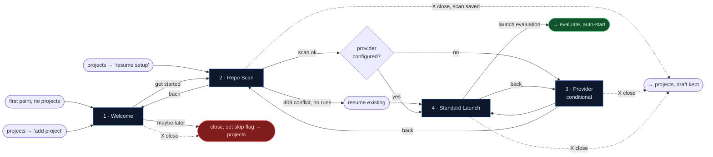
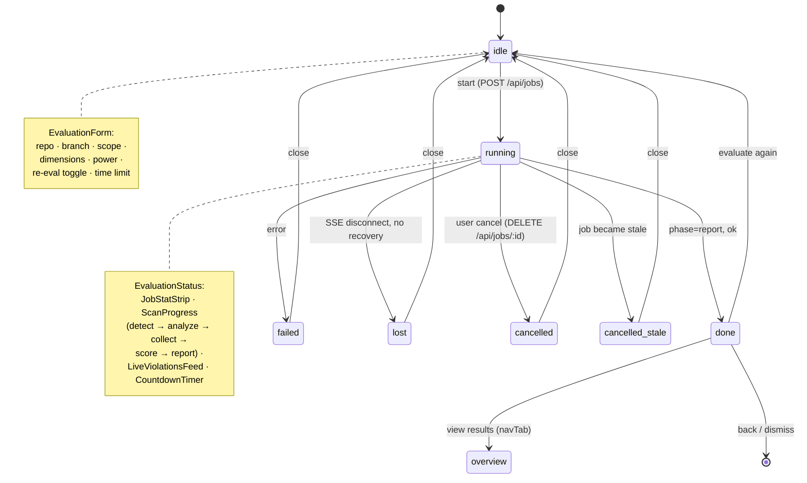
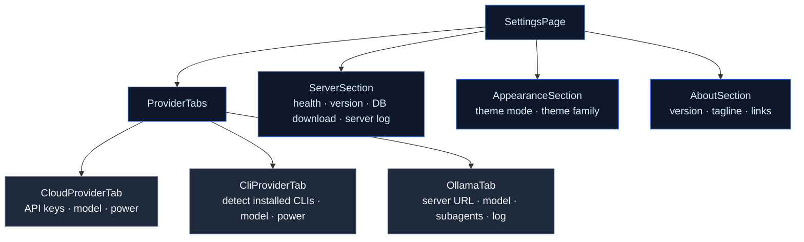

# Quodeq UI Map

> **🛠️ If you (Claude or human) are reading this while working on the UI: update this file before you commit.**
> Renamed a route? Update §1 + §5. Added a screen? Add a row to §5 and an arrow in §1. Changed the eval lifecycle?
> Update the §3 state diagram. New onboarding step? §2. The map is only useful if it stays current.

A living map of the web UI: every screen, the arrows between them, the non-trivial states, and the screenshots.
**Source of truth for navigation, onboarding, evaluation lifecycle, and settings.** Also the inventory we'll
hang the UI testing strategy off (Storybook + Playwright — see [§7 Critical Paths](#7-critical-paths)).

> Codebase lives at `src/quodeq/ui/src/`. The app uses a **custom navigation stack**
> (`hooks/useNavStack.js`) instead of react-router; route IDs are page identifiers passed to
> `handleNavigate(page, params)` in `App.jsx`.

**How to keep this current:** when you add/move/rename a screen or change a flow, update the relevant
diagram + the screen list. Diagrams are the structure; screenshots are the look.

---

## Table of contents

1. [Site map (top-level)](#1-site-map-top-level)
2. [Onboarding flow](#2-onboarding-flow)
3. [Analysis / Evaluation flow](#3-analysis--evaluation-flow)
4. [Settings](#4-settings)
5. [All screens (catalog)](#5-all-screens-catalog)
6. [Per-screen states](#6-per-screen-states)
7. [Critical paths (testing targets)](#7-critical-paths)
8. [Screenshot gallery](#8-screenshot-gallery)

---

## 1. Site map (top-level)

Every page identifier registered in `ROUTE_RENDERERS` (`App.jsx:214-301`), grouped by area.
Solid arrows = primary navigation. Dashed = conditional / guarded routes.



**Route IDs** (`App.jsx:214-301`):
`overview`, `violations`, `map`, `run`, `history`, `history-run`, `explorer`, `evaluate`, `file`,
`evalprinciple`, `finding`, `settings`, `projects`, `standards`, `help`.

**Route guards** (`App.jsx:309-320`, `App.jsx:38-39`, `App.jsx:390-401`):
- `NO_PROJECT_TABS` — accessible with zero projects: `projects`, `evaluate`, `standards`, `settings`, `help`.
- `SELF_HANDLED_EMPTY` — render their own empty state: `overview`, `map`, `violations`, `history`.
- All other "project-data" tabs bounce to `evaluate` if the project has no runs.
- First-paint with no projects → auto-opens the Onboarding Wizard (`App.jsx:372-383`).

---

## 2. Onboarding flow

**Goal:** brand-new user → first evaluation kicked off, in 4 steps.
**Component:** [`OnboardingWizard.jsx`](../src/quodeq/ui/src/features/onboarding/components/OnboardingWizard.jsx).
**Persistence:** wizard draft saved to `localStorage` (`saveDraft` / `clearDraft`) so the user can resume.



### Step details

| # | Step | File | Inputs / decisions | Exits |
|---|------|------|--------------------|-------|
| 1 | Welcome | [`WelcomeStep.jsx`](../src/quodeq/ui/src/features/onboarding/components/steps/WelcomeStep.jsx) | none — intro only | `get started` → repo-scan · `maybe later` → skip flag |
| 2 | Repo Scan | [`RepoScanStep.jsx`](../src/quodeq/ui/src/features/onboarding/components/steps/RepoScanStep.jsx) | URL/path input, local folder browser. States: idle / scanning / scanned / error. **409 conflict** → resume existing project if no runs | next step on success |
| 3 | Provider | [`ProviderStep.jsx`](../src/quodeq/ui/src/features/onboarding/components/steps/ProviderStep.jsx) | provider type (CLI/Ollama/Cloud), model, power level, subagents. **Auto-skipped** if already configured | next step |
| 4 | Standard Launch | [`StandardLaunchStep.jsx`](../src/quodeq/ui/src/features/onboarding/components/steps/StandardLaunchStep.jsx) | dimension picker, optional scope path / branch / time limit | `launch evaluation` → evaluate tab, auto-starts |

**Re-entry points:**
- `App.jsx:372-383` — auto-open if no projects + skip flag false + not currently evaluating.
- `Projects → 'add project'` — fresh wizard.
- `Projects → 'resume setup'` — wizard with `presetProjectId`, jumps to repo-scan or later.

---

## 3. Analysis / Evaluation flow

**Goal:** kick off an evaluation → watch it stream → land on results.
**Component:** [`EvaluateScreen.jsx`](../src/quodeq/ui/src/features/evaluation/components/EvaluateScreen.jsx).
**Lifecycle hook:** `useEvaluationLifecycle` (SSE-backed), `useRunEventStream` for live phase/violations.



### Form inputs (idle state)

[`EvaluationForm.jsx`](../src/quodeq/ui/src/features/evaluation/components/EvaluationForm.jsx)

- **Repository** — `TermInput` (`$ repo …`)
- **Branch** — `BranchScopeSelector`
- **Scope path** — `FolderBrowser` (sub-folder narrowing)
- **Dimensions** — `DimensionSelector` (multi-check, ISO 25010)
- **Power** — `PowerSelector` (fast / balanced / thorough)
- **Re-evaluate (Clean scan)** — `CleanScanToggle` (three states: off / once / permanent). Off = default incremental behavior. Once = next run is clean, then auto-resets. Permanent = every run is clean until toggled off. Persisted via `quodeq.cleanScan.permanent` in localStorage. Also wired on the Re-evaluate card after a run finishes.
- **Time limit** — `DEFAULT_TIME_LIMIT_S`, per provider
- **Provider badge** — `ActiveProviderBadge` (clickable → settings)

### Running state — live components

| Component | Shows |
|-----------|-------|
| `JobStatStrip` | live counts: violations / compliance, by severity & dimension |
| `ScanProgress` | current phase + % (`detect → analyze → collect → score → report`) |
| `LiveViolationsFeed` | rolling list of latest 4 violations as they stream in |
| `CountdownTimer` | deadline + remaining budget seconds |
| `EvalLogProvider` (SSE) | server logs, viewable in side-pane |

### Terminal state actions

[`ReEvaluateCard.jsx`](../src/quodeq/ui/src/features/evaluation/components/) — shown after `done`:
- **View Results** → `overview`
- **Evaluate Again** → resets form (same project)
- **Back** → idle form
- **Clean scan toggle** — same three-state toggle as the Scan form (off / once / permanent). Lets you schedule a clean re-run without navigating back to the form.

Failed / lost / cancelled show an error toast (5s auto-dismiss) and a `Close` action — no `View Results`.

---

## 4. Settings

**Component:** [`SettingsPage.jsx`](../src/quodeq/ui/src/features/settings/components/SettingsPage.jsx).
**Layout:** two-column grid — providers on the left, server/appearance/about on the right.



| Section | File | Controls |
|---------|------|----------|
| CloudProviderTab | [`CloudProviderTab.jsx`](../src/quodeq/ui/src/features/settings/components/CloudProviderTab.jsx) | provider list, API key (localStorage), model, power level |
| CliProviderTab | [`CliProviderTab.jsx`](../src/quodeq/ui/src/features/settings/components/CliProviderTab.jsx) | detected CLIs (Claude, Codex…), models per CLI, power |
| OllamaTab | [`OllamaTab.jsx`](../src/quodeq/ui/src/features/settings/components/OllamaTab.jsx) | server URL, status check, model dropdown, subagents (1–8), log viewer |
| ServerSection | [`ServerSection.jsx`](../src/quodeq/ui/src/features/settings/components/ServerSection.jsx) | health, version, download `evaluation.db`, server log stream |
| AppearanceSection | [`AppearanceSection.jsx`](../src/quodeq/ui/src/features/settings/components/AppearanceSection.jsx) | theme mode (dark/light/system), theme family (daruma/custom) |
| AboutSection | [`AboutSection.jsx`](../src/quodeq/ui/src/features/settings/components/AboutSection.jsx) | version, random tagline, doc/repo links |
| Grade formula | [`GradeFormulaPage.jsx`](../src/quodeq/ui/src/features/grade-formula/GradeFormulaPage.jsx) | Q² tuning sliders (SEVERITY / CURVE / BOUNDARIES / DIMENSIONS tabs), before/after preview gauges, APPLY (rescores all runs), RESET to Q2 defaults |

**Cross-link from Evaluate:** `ActiveProviderBadge` on `EvaluateScreen` → opens `settings`.

---

## 5. All screens (catalog)

The full screen list, with one-line description, key sub-components, and where each one navigates to.

| Screen | Route ID | File | What it shows | Navigates to |
|--------|---------|------|---------------|--------------|
| **Projects** | `projects` | [`ProjectsPage.jsx`](../src/quodeq/ui/src/features/dashboard/components/ProjectsPage.jsx) | All projects with grade, score, file counts, latest-run metadata. Add/delete/export/relocate/resume. | wizard, overview |
| **Overview** | `overview` | [`DashboardPage.jsx`](../src/quodeq/ui/src/features/dashboard/components/DashboardPage.jsx) | Accumulated dimension grid, principles, top findings table. | explorer, evalprinciple, file, projects, evaluate |
| **Run detail** | `history-run` | `DashboardPage` (run mode) | Single-run snapshot via `RunOverviewPanel`. | explorer |
| **Violations** | `violations` | [`ViolationsPage.jsx`](../src/quodeq/ui/src/features/violations/components/ViolationsPage.jsx) | Active/Dismissed sub-tabs · dimension heatgrid + file tree · severity filters. | explorer, file, evalprinciple |
| **Map** | `map` | [`MapPage.jsx`](../src/quodeq/ui/src/features/map/components/MapPage.jsx) | Health/Violations toggle. Viz: Circle Pack, Galaxy (filesystem/standards), Risk Matrix. Drill-down breadcrumb. | file, evalprinciple |
| **History** | `history` | [`HistoryPage.jsx`](../src/quodeq/ui/src/features/history/components/HistoryPage.jsx) | Run timeline with grade/score/delta · trend chart · run navigator · deleted-run tombstones. | history-run, explorer |
| **Evaluate** | `evaluate` | [`EvaluateScreen.jsx`](../src/quodeq/ui/src/features/evaluation/components/EvaluateScreen.jsx) | Form / running / done / failed lifecycle (see §3). | settings, overview |
| **Explorer** | `explorer` | [`ExplorerPage.jsx`](../src/quodeq/ui/src/features/explorer/components/ExplorerPage.jsx) | Per-dimension: stat grid, principles radial, principle cards, top offending files, dimension trend. | evalprinciple, file |
| **Principle detail** | `evalprinciple` | [`PrincipleDetailPage.jsx`](../src/quodeq/ui/src/features/explorer/components/PrincipleDetailPage.jsx) | Violations grouped by severity (CRITICAL/MAJOR/MINOR) + compliance list. Dismissable. Side-pane: report + fix-plan. | side-pane only |
| **File detail** | `file` | [`FileDetailPage.jsx`](../src/quodeq/ui/src/features/explorer/components/FileDetailPage.jsx) | All violations + compliance for a single file, with severity badges. Side-pane fix-plan per violation. | side-pane only |
| **Finding detail** | `finding` | [`FindingDetailPage.jsx`](../src/quodeq/ui/src/features/explorer/components/FindingDetailPage.jsx) | Single violation card with breadcrumb (overview › dimension › principle). Leaf view. | — |
| **Settings** | `settings` | [`SettingsPage.jsx`](../src/quodeq/ui/src/features/settings/components/SettingsPage.jsx) | See §4. | grade-formula |
| **Standards** | `standards` | [`StandardsPage.jsx`](../src/quodeq/ui/src/features/standards/StandardsPage.jsx) | List/Edit/New views. Standards table grouped by category, principle/requirement editor, import modal. | — |
| **Help** | `help` | [`HelpPage.jsx`](../src/quodeq/ui/src/features/help/components/HelpPage.jsx) | 10 sections (Philosophy, Getting Started, AI Providers, Running Evaluations, Quality Dimensions, Violations, Code Map, Custom Standards, Settings, Sub-projects). | — |
| **Onboarding Wizard** | (modal) | [`OnboardingWizard.jsx`](../src/quodeq/ui/src/features/onboarding/components/OnboardingWizard.jsx) | See §2. | evaluate, projects |

### Grade formula (`grade-formula`)

Pushed from Settings. Tabs: SEVERITY / CURVE / BOUNDARIES / DIMENSIONS.
Bottom strip: before/after preview gauges (latest run of the selected
project, server-computed via POST /api/grade-formula/preview, debounced).
APPLY (confirm) rescores all runs via PUT /api/grade-formula; RESET Q2 via
DELETE. Flow: settings > grade-formula > (apply) > dashboards refetch.

### Cross-cutting UI

- **Sidebar** — [`Sidebar.jsx`](../src/quodeq/ui/src/components/Sidebar.jsx) — primary nav.
- **TopBar** — [`TopBar.jsx`](../src/quodeq/ui/src/components/TopBar.jsx) — project name, breadcrumb, theme toggle.
- **Side-pane dock** — [`SidePane.jsx`](../src/quodeq/ui/src/features/side-pane/SidePane.jsx) — multi-window, resizable, on right edge.
  Window specs: `ReportContent` (markdown reports), `violationFixPlanSpec` (copy-pasteable AI prompt).
- **Toasts** — `useSidePane().showToast(message)` for transient errors/confirmations.

---

## 6. Per-screen states

Screens with non-trivial UI state machines that deserve their own state diagram (later — placeholders here so we know what's worth diagramming).

| Screen | States to diagram |
|--------|-------------------|
| EvaluateScreen | `idle` / `running` (with phase sub-states) / `done` / `failed` / `lost` / `cancelled` / `cancelled_stale` — **already in §3** |
| OnboardingWizard | `welcome` / `repo-scan` (idle/scanning/scanned/error) / `provider` / `standard-launch` — **already in §2** |
| RepoScanStep | `idle` / `scanning` / `scanned` / `error` / `409-conflict` |
| Overview | `null focus` (all dimensions) / `dimension focus` (single card) / `run mode` |
| Violations | `Active` / `Dismissed` sub-tabs · view mode `dimension-grid` / `file-tree` |
| Map | mode `health` / `violations` × style `pack` / `galaxy` / `risk-matrix` (galaxy has `filesystem` / `standards`) |
| History | `latest run` / `specific run` · chart loaded / lazy-loading |
| Standards | `list` / `edit` / `new` · import modal open/closed |

---

## 7. Critical paths

The arrows worth covering with **Playwright E2E** tests. Everything else gets cheaper coverage via Storybook + unit tests.

> Picking these is a judgement call — proposing a starting set; we should refine together.

| # | Path | Why critical |
|---|------|--------------|
| 1 | first-launch → wizard → repo-scan → launch eval → done → overview | Whole onboarding promise; if this breaks, new users bounce. |
| 2 | projects → select project → overview → click dimension → explorer → click principle → principle detail | Core "explore findings" loop. |
| 3 | evaluate (with provider configured) → running → cancel → idle | Cancellation correctness — historically fragile (graceful-cancel work). |
| 4 | evaluate → done → view results → overview shows new run | Pipeline-to-UI handoff; SSE/SQLite projection correctness. |
| 5 | settings → switch provider → evaluate → run completes | Multi-provider regression guard. |
| 6 | violations → file tree drill-down → file detail → fix-plan side-pane | Side-pane contract + breadcrumb state. |
| 7 | history → pick old run → history-run → drill into dimension | Historical-run rendering parity with latest. |
| 8 | standards → new → save → appears in list → toggle visibility | Standards CRUD. |
| 9 | settings → grade-formula → adjust slider → preview updates → APPLY → overview shows updated grades | Grade formula editor end-to-end; rescore pipeline correctness. |

For everything else (individual cards, severity pills, tooltips, theme toggle, etc.) — Storybook stories with visual snapshots. Cheap, catches regressions, no flake.

---

## 8. Screenshot gallery

Drop screenshots in `docs/screenshots/` and link them here. Use the anchor-id pattern so diagram nodes can deep-link:

```markdown
### <a id="ss-overview"></a>Overview

```

Then in a diagram label: `Overview[overview<br/><a href='#ss-overview'>📷</a>]`.

> **TODO:** capture initial baseline screenshots for every screen in §5. Suggested order — onboarding steps, evaluate (each lifecycle state), overview, violations, map (each viz), settings tabs.

<!-- Screenshots will go here as we capture them. -->
```

